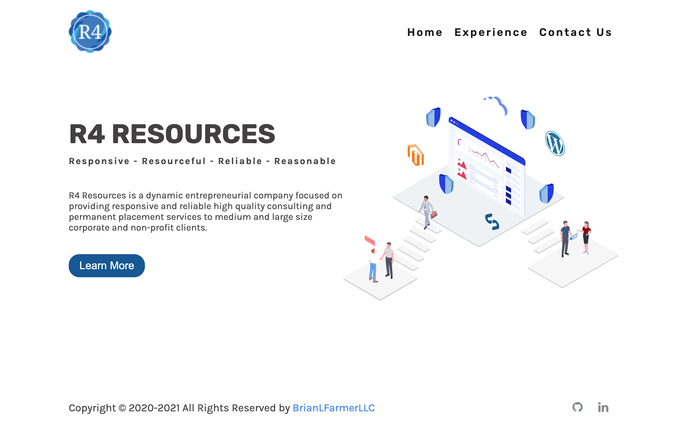

# R4 Resources

Small business React.js app with both flex box and grid layouts. Utilizing SASS preprocessor to incorporate cross browser compatibility. Static site utilizing Netlify forms to handle form submissions.

## Table of contents

- [Overview](#overview)
- [The challenge](#the-challenge)
- [Screenshot](#screenshot)
- [Links](#links)
- [My process](#my-process)
- [Built with](#built-with)
- [What I learned](#what-i-learned)
- [Continued development](#continued-development)
- [Useful resources](#useful-resources)
- [Author](#author)

## Overview

### The challenge

The user should be able to:

- Navigate the site in desktop and mobile views
- Use the navigation menu to move to the corresponding page
- Use the anchor tags to navigate through the application
- Generate form by inquiry type
- Upload a resume in the form
- Send a contact form to netlify forms

### Screenshot



### Links

- GitHub URL: [https://github.com/brianlfarmerllc/R4_Resources](https://github.com/brianlfarmerllc/R4_Resources)
- Live Site URL: [https://small-bus-site.netlify.app/](https://small-bus-site.netlify.app/)

## My process

### Built with

- React.Js
- Node.Js
- Semantic HTML5 markup
- SASS preprocessor
- Netlify Forms

### What I learned

In the past I always used nodemailer to send form information but I wanted to host this site on netlify so I could not set up a express server for the backend. I discovered that I could use a built in tool with netlify called netlify forms for free. All I had to do was set up a hidden form in my public index.js file with the netlify and netlify-honeypot attibute atteched to the form.

```html
<body>
  <noscript>You need to enable JavaScript to run this app.</noscript>
  <div id="root"></div>

  <form name="contact" netlify netlify-honeypot="bot-field" hidden>
    <select name="contactType"></select>
    <input type="file" name="resume" />
    <input type="text" name="company" />
    <input type="text" name="first" />
    <input type="text" name="last" />
    <input type="tel" name="phone" />
    <input type="email" name="email" />
    <textarea name="message"></textarea>
  </form>
</body>
```

Then in my JSX rendered form I had to include a POST method and a netlify-data attribute along with a hidden input to reference the hidden form element in the public index.html and netlify did all the rest.

```HTML
  <form name="contact" method="POST" data-netlify="true">
          <input type="hidden" name="form-name" value="contact" />
  </form>
```

### Continued development

Learning

### Useful resources

- [Netlify Forms Docs](https://docs.netlify.com/forms/setup/#more-forms-resources) - They cover a lot of different form integration methods in their online documentation.
- [Netlify Forms Docs React Specific](https://www.netlify.com/blog/2017/07/20/how-to-integrate-netlifys-form-handling-in-a-react-app/?_ga=2.53202667.234191971.1624120940-2092404297.1622132086) - As well as specific instructions for react.

## Author

- Website - [Portfolio Site](https://brianfarmerwebdev.netlify.app)
- GitHub URL: - [GitHub URL](https://github.com/brianlfarmerllc)
